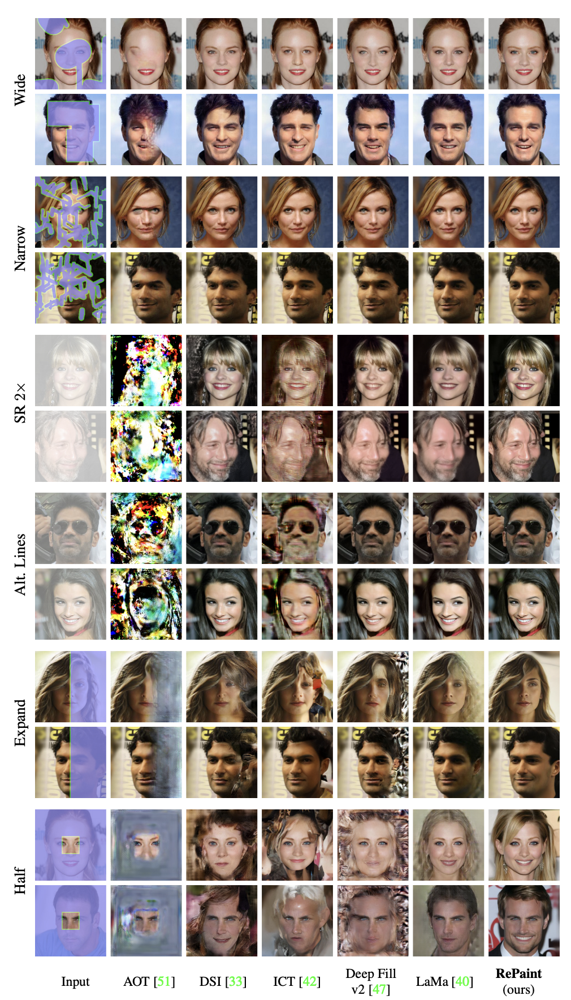
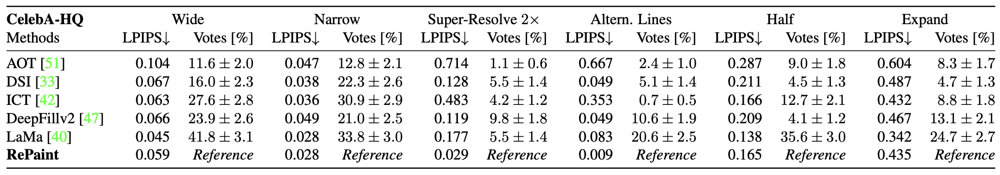
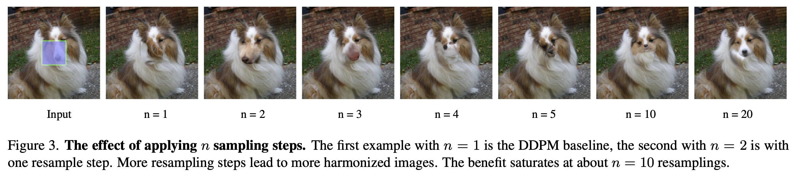
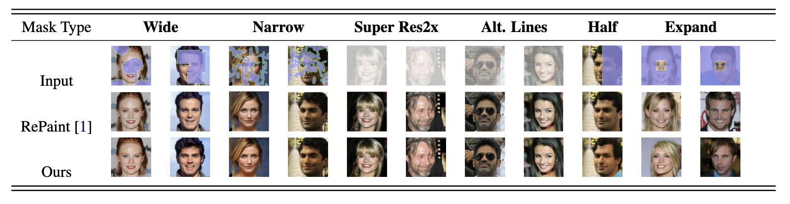
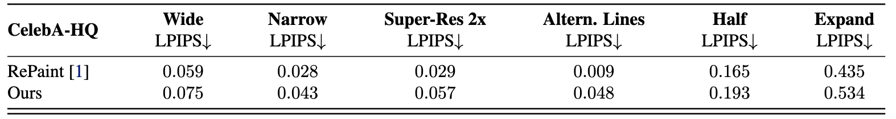
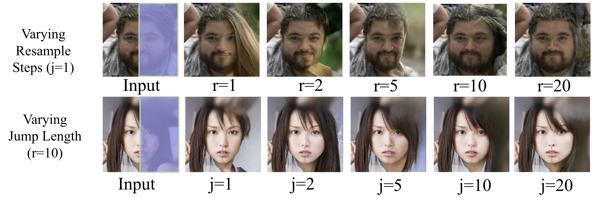

# RePaint-reimplementation

## Introduction

- Purpose of this Git repo (mention how this is a project that attempts to re-implement your paper of choice)
- Introduce the paper chosen and its main contribution.

This project aims to reimplement the paper RePaint: Inpainting using Denoising Diffusion Probabilistic Models. RePaint is a diffusion-based image inpainting method that excels at filling in large or complex missing regions by repeatedly resampling during the reverse diffusion process. Unlike traditional diffusion models that follow a fixed backward trajectory, RePaint introduces jumps-steps where the model intentionally moves backward in time before continuing forward-allowing it to better explore plausible completions and maintain global coherence. This makes it particularly effective for challenging masks, such as alternating lines or irregular holes.

The key contributions of the paper include: (1) a conditioning method that does not require retraining the DDPM, (2) a resampling schedule that improves semantic coherence, and (3) strong empirical results that outperform GAN and autoregressive baselines on multiple mask types.

## Chosen Result

In the original paper, the authors trained a DDPM on the CelebA-HQ dataset for 250,000 iterations, which takes 5 days even on 4×V100 GPUs. Due to resource constraints and the fact that the RePaint algorithm is adaptable to various DDPMs, we utilize pretrained models and focus on the CelebA-HQ dataset to reproduce the following:

- The visualization results using different masks presented in Figure 4:

  

- The LPIPS results in Table 1:
  

- Ablation results on the effect of resampling steps and jump length demonstrated in Figures 3
  

This includes the reproduction of the paper's main contribution, the Repaint method, as well as the evaluation results that will serve as proof of the validity of our implementation.

## GitHub Contents

- `code/`: A directory containing the re-implementation code.

- `data/`: A directory containing the datasets used for training and evaluation.

- `results/`: A directory containing the results of re-implementation, including generated figures, tables, or log files.

- `poster/`: A directory containing a PDF of the poster used for in-class presentation.

- `report/`: A directory containing a PDF of the final report submitted.

- `LICENSE`: MIT License.

- `.gitignore`: A file specifying files or directories that should be ignored by Git.

## Re-implementation Details

- Describe your approach to re-implementation or experimentation.
- Include key details about models, datasets, tools, and evaluation metrics.
- Mention any challenges or modifications made to the original approach.

We reimplemented the RePaint inpainting method, which modifies the unconditional DDPM's reverse process by conditioning on known regions and resampling (jumping forward in the reverse process). Our approach directly uses a pre-trained ddpm-celebahq-256 model from Google, trained on the CelebA-HQ-256 dataset. No model retraining or architecture modifications were required.

In our reimplementation, we focused on the following components:

* Condition on known area: At each denoising step, noise is added to the known (unmasked) region, preserving its content. The UNet model predicts noise for the masked region, and these are combined to form the inpainted image.

* Bidirectional Resampling: To enhance semantic consistency, we introduced a resampling step where the inpainted region is noised and denoised multiple times. For efficiency, we applied resampling every 10 reverse steps, experimenting with different forward jump lengths.

* Performance Evaluation: We evaluated the method using LPIPS scores on CelebA-HQ-256, comparing our results with the original paper.

## Reproduction Steps

As meta as this section is, it essentially documents steps someone would need to follow to
implement your GitHub repo in a local environment.

- Describe "how someone using your GitHub can re-implement your re-implementation?"
- Provide instructions for running your code, including any dependencies, required libraries, and command-line arguments.
- Specify the computational resources (e.g., GPU) needed to reproduce your results

**Prerequisites**: 

- GPU recommended. A CUDA-compatible GPU like A100 or T4. 
- Pre-trained diffusion model (eg. ddpm-celebahq-256). you can download pre-trained models from [Huggingface](https://huggingface.co/google/ddpm-celebahq-256).

**Step by step guide**:
- Step 1: Clone the repository.
```
git clone https://github.com/HongruiTang/RePaint-reimplementation
cd RePaint-reimplementation
```

- Step 2: Create and activate a virtual environment.
```
conda create -n repaint-env python=3.9 -y
conda activate repaint-env
```

- Step 3: Install dependencies
```
pip install -r requirements.txt
``` 

- Step 4: Go to [code/repaint.py](code/repaint.py) file and run the code using 
```
python code/repaint.py
```

In code/repaint.py, you can specify different `resample_steps` and `jump_length` when creating the RePaint scheduler. We have provide some example masks in the data/mask directory which you can use directly. You are encouraged to create your own mask to evaluate the RePaint algorithm.


## Results/Insights

- Present your re-implementation results as a comparison to the original paper's findings.
- Describes "what can someone expect as the end-result of using your GitHub repo?"

We achieved results comparable to those of the original paper on the CelebA-HQ dataset. In this section, we present our results and compare them to the original paper.A

### Visual Results

The original paper conducted experiments over a wide range
of masks with different test images and compared their
results against several other state-of-the-art methods for
CelebA-HQ inpainting. We also generated images using
the same masks and test images, and visually compared our
results with the original paper's results. As can be seen
from the comparison, our output is similar to the output
from the original paper in terms of the level of detail andsemantic correctness.




### Evaluation Result

In order to evaluate the performance of the model, we computed the LPIPS score of our model on different masks-lower LPIPS score are desirable as they indicate that image patches are perceptually similar. Table 1 shows the score from the original paper on the 2nd-to-last row, and our result on the last row.



### Ablation Study

We conducted an ablation study to observe the effect of
using different jump lengths and resample steps on the resulting image. We arrived at a similar conclusion as the
original paper-increasing the resampling steps and jump
length generates more harmonized images, but the benefits
saturate at approximately r = 10 and j = 10.



## Conclusion

**Key Takeaways**:

RePaint presents a novel conditioning method that enables pretrained unconditional diffusion models to perform inpainting across a wide variety of mask types. Its unified inference schedule ensures harmonization between known and generated regions, resulting in semantically coherent image completions. Our implementation successfully reproduced the original results on CelebA-HQ, achieving comparable LPIPS metrics across multiple mask types. Moreover, our ablation experiments revealed similar performance trends to those reported in the original paper, reinforcing the validity of RePaint’s design.

**Lessons Learned**:

One of the key lessons was the importance of assessing the computational feasibility of a project early on. While the RePaint method is elegant in theory, its iterative sampling procedure is resource-intensive, requiring thoughtful planning and resource management even when we are simply utilizing the base model at inference time instead of training deep models from scratch. Additionally, it was interesting to note that the intuition behind the RePaint method, including the effects of changing various hyperparameters, was actually quite straightforward, which is perhaps further testament to how simple ideas often work best, even in deep learning.

## References

- Lugmayr, A., Danelljan, M., Romero, A., Yu, F., Timofte, R., Van Gool, L., 2022. Repaint: Inpainting using denoising diffusion probabilistic models, in: Proceedings of the IEEE/CVF conference on computer vision and pattern recognition, pp. 11461–11471.


## Acknowledgements

- Recognition goes a long way in setting up the context of your work. Your acknowledgements also act as an indirect validation about the quality of the work. For eg. having done this project as part of coursework is a sign that the work was potentially peer-reviewed or graded - i.e. added authenticity.
