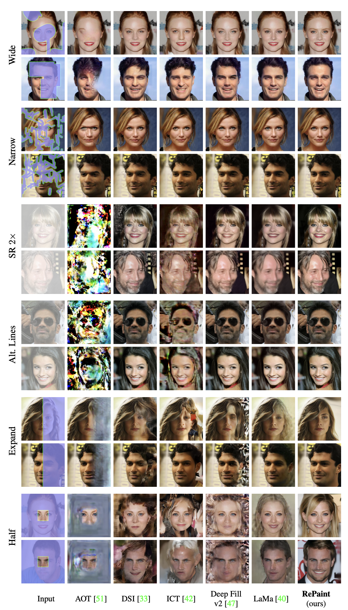
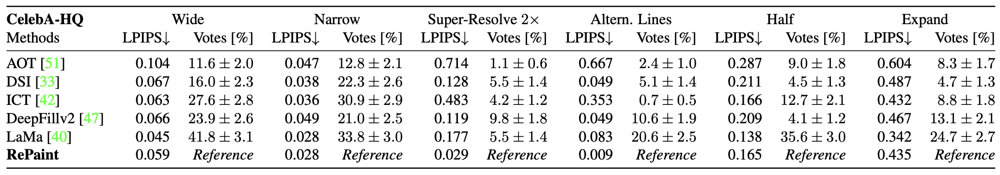
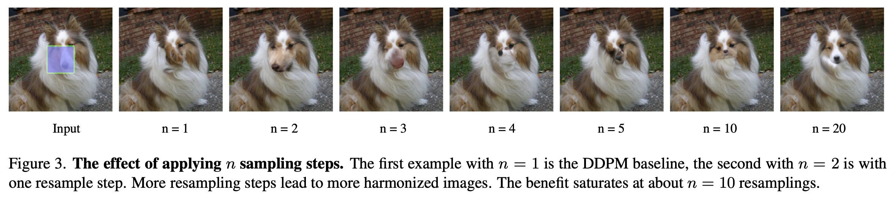

# RePaint-reimplementation

## Introduction

- Purpose of this Git repo (mention how this is a project that attempts to re-implement your paper of choice)
- Introduce the paper chosen and its main contribution.

This project aims to reimplement the paper RePaint: Inpainting using Denoising Diffusion Probabilistic Models. RePaint is a diffusion-based image inpainting method that excels at filling in large or complex missing regions by repeatedly resampling during the reverse diffusion process. Unlike traditional diffusion models that follow a fixed backward trajectory, RePaint introduces jumps—steps where the model intentionally moves backward in time before continuing forward—allowing it to better explore plausible completions and maintain global coherence. This makes it particularly effective for challenging masks, such as alternating lines or irregular holes.

## Chosen Result

- Identify the specific result you aimed to reproduce and its significance in the context of the paper’s main contribution(s).
- Include the relevant figure, table, or equation reference from the original paper.

Due to resource constraints, we are unable to train an unconditional DDPM model from scratch. Instead, we will utilize pretrained models, and as a result, we focus on the CelebA-HQ dataset to reproduce:

- The visualization results using different masks similar to Figure 4
  

- The LPIPS results similar to Table 1
  

- Ablation results on the effect of resampling steps and jump length – visualization similar to Figure 3/7
  

This includes reproduction of the paper’s main contribution, the Repaint method, as well as evaluation results that will serve as proof of the validity of our implementation.

## GitHub Contents

- Make a brief note about the content structure of your project

- `code/`: A directory containing the re-implementation code, along with any necessary configuration files or scripts.

- `data/`: A directory containing the datasets used for training and evaluation.

- `results/`: A directory containing the results of re-implementation, including generated figures, tables, or log files.

- `poster/`: A directory containing a PDF of the poster used for in-class presentation.

- `report/`: A directory containing a PDF of the final report submitted.

- `LICENSE`: MIT Licnese.

- `.gitignore`: A file specifying files or directories that should be ignored by Git.

## Re-implementation Details

- Describe your approach to re-implementation or experimentation.
- Include key details about models, datasets, tools, and evaluation metrics.
- Mention any challenges or modifications made to the original approach.

## Reproduction Steps

As meta as this section is, it essentially documents steps someone would need to follow to
implement your GitHub repo in a local environment.

- Describe ”how someone using your GitHub can re-implement your re-implementation?”
- Provide instructions for running your code, including any dependencies, required libraries, and command-line arguments.
- Specify the computational resources (e.g., GPU) needed to reproduce your results

## Results/Insights

- Present your re-implementation results as a comparison to the original paper’s findings.
- Describes ”what can someone expect as the end-result of using your GitHub repo?”

## Conclusion

- Summarize the key takeaways from your re-implementation effort and the lessons learned.

## References

- Include a list of references, including the original paper and any additional resources used in your re-implementation.

- Lugmayr, A., Danelljan, M., Romero, A., Yu, F., Timofte, R., Van Gool, L., 2022. Repaint: Inpainting using denoising diffusion probabilistic models, in: Proceedings of the IEEE/CVF conference on computer vision and pattern recognition, pp. 11461–11471.

- Peng, J., Liu, D., Xu, S., Li, H., 2021. Generating diverse structure for image inpainting with hierarchical vq-vae, in: Proceedings of the IEEE/CVF conference on computer vision and pattern recognition, pp.10775–10784.

- Suvorov, R., Logacheva, E., Mashikhin, A., Remizova, A., Ashukha, A., Silvestrov, A., Kong, N., Goka, H., Park, K., Lempitsky, V., 2022. Resolution-robust large mask inpainting with fourier convolutions, in: Proceedings of the IEEE/CVF winter conference on applications of computer vision, pp. 2149–2159.

- Wan, Z., Zhang, J., Chen, D., Liao, J., 2021. High-fidelity pluralistic image completion with transformers, in: Proceedings of the IEEE/CVF international conference on computer vision, pp. 4692–4701.

- Yu, J., Lin, Z., Yang, J., Shen, X., Lu, X., Huang, T.S., 2018. Generative image inpainting with contextual attention, in: Proceedings of the IEEE conference on computer vision and pattern recognition, pp. 5505–5514.

- Zeng, Y., Fu, J., Chao, H., Guo, B., 2022. Aggregated contextual transformations for high-resolution image inpainting. IEEE transactions on visualization and computer graphics 29, 3266–3280.

## Acknowledgements

- Recognition goes a long way in setting up the context of your work. Your acknowledgements also act as an indirect validation about the quality of the work. For eg. having done this project as part of coursework is a sign that the work was potentially peer-reviewed or graded - i.e. added authenticity.
